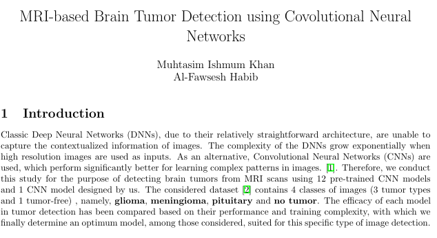
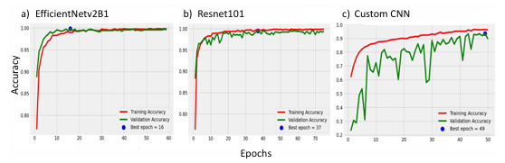

## MRI-based Brain Tumor Detection using Covolutional Neural Networks

## Result

## How to run the project locally:

1. Download the dataset from the link: https://www.kaggle.com/datasets/masoudnickparvar/brain-tumor-mri-dataset/data?select=Training

2. Open jupyter notebook.

3. Load any of the model from the Codes_for_models folder into jupyter notebook.

4.  In the Load Training Data and Load Test Data part in the code you can see a path. Change that path to the current path where you have downloaded the dataset.

5. Run the code.

## How to run the project in Google Colab:

1. Open google colab

2. Generate your API token from kaggle 
 Login to kaggle => Settings => Scroll down to find API section => Click on create new token => Download the token

3. Import dataset from kaggle with these sets of command.
	
Install Kaggle
!pip install kaggle

Upload you API token kaggle.json:
from google.colab import files
files.upload()

#Create a directory kaggle
!mkdir ~/.kaggle
#Copy kaggle.json file
!cp kaggle.json ~/.kaggle/
#Grant Permissions
!chmod 600 ~/.kaggle/kaggle.json

## download dataset
! kaggle datasets download  masoudnickparvar/brain-tumor-mri-dataset

!unzip brain-tumor-mri-dataset.zip

4.  In the Load Train data set the path to:
	tr_df = train_df('/content/Training')

5.  In the Load Test data set the path to:
	ts_df = test_df('/content/Testing')

6. Run the code.

